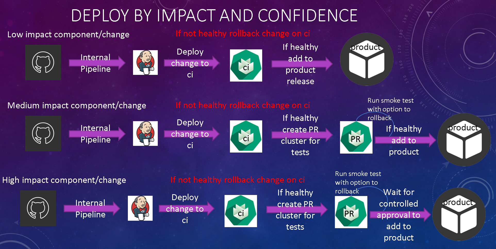
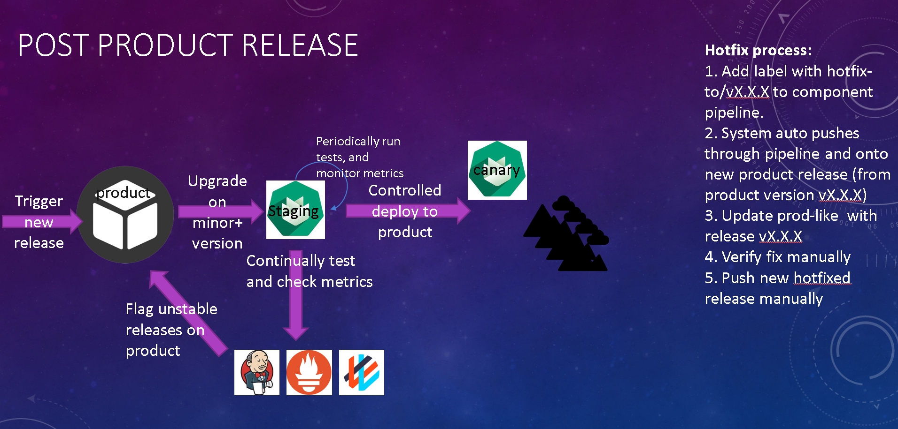

# Component to Production Design
  

## Glossary and Info
* Component - Microservice usually helmchart + docker in a repo
* Product - Repo containing the declaritive description of all the different components
* Landscape - Repo containing the declaritive description of a specfic env configuration (CI, Staging...)
* Any individual env: CI, Staging, Canary, Prod is defined as multiple k8s custers

## Component Commit by Impact and Internal Pipelines
Internal pipelines will be the sole responsibility of each and every development team, however as part of this design we will enforce certain **engineering standards**.
And only merge to our product those components that meet those standards. Part of the job will be to find/develop tools that will enforce and maintain these standards.

## Individual Component Commits
### Conventional Commits Changelog
Whether via tools enforcement or manually, each commit should contain a proper commit history that describes the change in a human readable fashion. In the end relevant commits logs from all components will be bundled up and displayed as part of the product changelog commit history. Usage of [conventional commits](https://www.conventionalcommits.org/en/v1.0.0/)

### Semver Usage
Each component will only create tags that follow [semver guidelines](https://semver.org/). Usage of certain tools such as [commitizen](https://github.com/commitizen/cz-cli) to enforce this will be considered. This will allow us to get actual information from the created tag (patch, minor, major) change.

### GitHub Label Usage
While Semver provides us with information, it is not enough. Components will need to label their PR to product with at least the following info:  
* component: XL,L,M,S...
* change: XL,L,M,S...
* ft-coverage: 100-0
* functional: true/false

## Component to Product
### PR to Product
1. Only be opened on functional changes (either by using semver or github labels). Product CI will not test/merge any changes that do not meet the previous demands.  
1. Only PR's that contain the above labels will be considered for auto-merge.

### Product CI and PR automerge
CI is a very fluid environment, where we don't care about the specific business logic of the product or the components. All we care about is that individual components are deployed correctly with no issue. No tests are run on CI, and developers don't work on it.
1. Calculate risk with change, add label to calculated risk and start the ci
1. Upgrade specific component on CI landscape (A change from redeploying entire CI)
1. Monitor specific component deployment status - if unhealthy rollback and fail component test
1. If risk medium, Create PR test cluster - Run smoke tests - if unhealthy rollback and fail component test -- Test twice for FT on/off (if labeled as FT)
1. If risk High, Create PR test cluster - Run smoke tests - Keep cluster alive and wait for manual approval -- Test twice for FT on/off (if labeled as FT)
1. On every merge to master - Calculate the semver version on product, collect and prettify commit changelog - tag product

### Product Staging
Staging environment is a new concept where the product tag lives for some time (TBD), and is subjected to constant testing (business, performance, chaos, security...). The purpose of this environment is only 1: to get an accurate measure of how stable the product is. At this point we should not be worried that the product cannot deploy or that our basic business logic fails. 
1. On minor+ tag to product (or X amount of time, or some other trigger) -> deploy change to staging
1. Staging is constantly monitored, and info about it's state is saved. 
1. On staging upgrade, get best info and store it in git history about the tag - create release from any tag that passes stability score KPI

## Deployment to Canary and Production
Done on demand, after management and product look at the the latest tags and decide on which tag they want to upgrade to according to stability score and features included in tag.  
Deployment to production follows best practices (Canary deployment, scale with confidence, active-active...)

## Hotfix Process
1. Add label with hotfix-to/vX.X.X to component pipeline.
1. System auto pushes through pipeline and onto new product release (from product version vX.X.X) 
1. Update canary with release vX.X.X 
1. Verify fix manually - trigger scale with confidence deployment to rest of production

## Feature Toggle
While feature toggle is a great tool, it doesn't fit every scenario. This is why the deployment process needs to run without considering it on every change.  
Any changes with feature toggle included will be tested twice (feature toggle on/off) and be deployed to staging -> canary -> prod with feature toggle **on (by default)**.  
Feature toggle will be used to prevent hotfixes where instead of fixing some feature we can just roll it back instantly.  
This should be the **only usage of feature toggle** to avoid having to keep a correct state and history of features and timelines of where they should be turned on/off.

## Open Issues and Considerations
* Internal pipeline enforcement tools (labels, commit history, semver)
* Feature toggle more complex design integration
* CI and PR clusters - major engineering investment to make sure that components can be tested parallel or be blocking if they are core - naive approach is to run (high impact changes) serially. More design to fix all edge cases should be done.
* Staging - major engineering effort to create a good testing environment and be confident with it's findings
* Actual deployment to production using canary-deployment / active-active practices should be addressed in a more detailed design, for now we can choose the simpler one and go with that.
